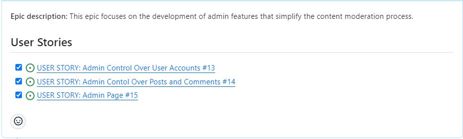
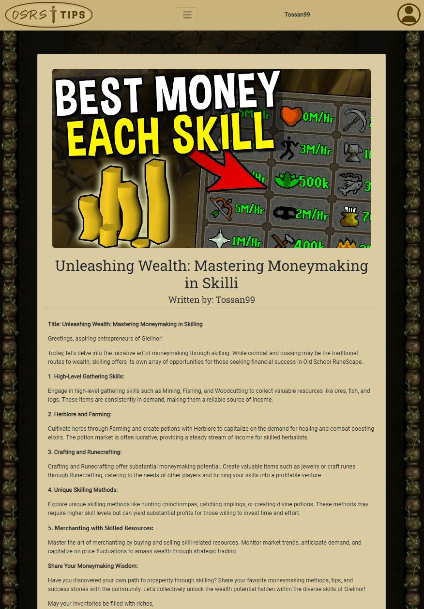

# OSRS Tips

 

Welcome to OSRS Tips, your go-to spot for Old School RuneScape wisdom! Join our friendly community where players share helpful tips and tricks. Whether you're a seasoned player or just starting out, find advice on boss battles, skilling, and the best gear. Contribute your own tips or explore the forums for valuable insights from our passionate community.

At OSRS Tips, we're all about making your RuneScape journey more enjoyable and successful. Dive in, join the conversation, and expand your knowledge with us! ⚔️🛡️

    
Vissit OSRS Tips live website here! [OSRS Tips](https://osrs-tips-1f9070447937.herokuapp.com/about/)

Vissit OSRS Tips repository here! [Git Hub OSRS Tips](https://github.com/Tossan99/osrs-tips)

## Table of Contents

# Project Goals

OSRS Tips is committed to creating a dynamic and user-friendly platform for the Old School RuneScape community. Our mission is to establish a central hub where players can share, discover, and enrich their gaming experience through valuable tips and tricks.

## User Goals

- **Knowledge Enhancement:** Get a greater understanding of Old School RuneScape through valuable tips and tricks shared by the community.

- **Community Interaction:** Engage with a vibrant community, share their experiences, and learn from fellow players.

- **Efficient Gameplay:** Seek tips that improve users gameplay efficiency, whether it's skilling, questing, or combat strategies.

- **Problem-Solving:** Find solutions to in-game challenges and problems through the collective knowledge of the community.

- **Skill Improvement:** Improve users skills and progress in the game by adopting effective strategies and techniques.

## Site Owner Goals

- **Community Growth:** Foster a growing and engaged community of Old School RuneScape players.

- **Content Quality:** Ensure the platform maintains a high standard of valuable content through effective content moderation.

- **User Retention:** Encourage repeat visits and user loyalty by continuously providing fresh and relevant content.
  
[Back to top ⇧](#table-of-contents)

# User Experience

## Target Audience

The targeted audience of OSRS Tips forum is the community of players who engage with Old School RuneScape (OSRS). This audience may include players of various skill levels, from beginners seeking guidance on game mechanics to experienced players sharing advanced strategies and insights. The forum may also attract individuals interested in the social aspects of gaming, such as connecting with other players, participating in discussions, and staying updated on the latest trends and updates in the OSRS community.

## First time user

New users are greeted by the about page, which gives a short describtion of forum
and an option to log in, sign up or continue to posts as a guest. First time users can easily navigate the site through the navbar.

## Registered User

Once registered, users can fully engage with the forum. These include creating your own posts, liking others and leaving comments.

## Admin user

Administrative features are accessible through the Django admin panel. These include having full CRUD over users posts, comments and likes. This level of control ensures that the forum is accurately represented on the website.

## User Stories

### [Epic 1: New Users First Impression](https://github.com/Tossan99/osrs-tips/issues/2)

- [USER STORY: Get Familiar With the Website](https://github.com/Tossan99/osrs-tips/issues/6)
- [USER STORY: User Navigation](https://github.com/Tossan99/osrs-tips/issues/7)
- [USER STORY: Search bar](https://github.com/Tossan99/osrs-tips/issues/9)
- [USER STORY: Register an Account](https://github.com/Tossan99/osrs-tips/issues/10)

### [EPIC 2: Registered Users Interaction and Engagement](https://github.com/Tossan99/osrs-tips/issues/3)

- [USER STORY: Personalized Profile](https://github.com/Tossan99/osrs-tips/issues/8)
- [USER STORY: Submitting Posts](https://github.com/Tossan99/osrs-tips/issues/11)
- [USER STORY: Leaving Comments](https://github.com/Tossan99/osrs-tips/issues/12)

### [EPIC 3: Moderator Content Management](https://github.com/Tossan99/osrs-tips/issues/4)

- [USER STORY: Admin Control Over User Accounts](https://github.com/Tossan99/osrs-tips/issues/13)
- [USER STORY: Admin Contol Over Posts and Comments](https://github.com/Tossan99/osrs-tips/issues/14)
- [USER STORY: Admin Page](https://github.com/Tossan99/osrs-tips/issues/15)

For more information vissit the complete [Kanban Board here.](https://github.com/Tossan99/osrs-tips/projects?query=is%3Aopen)

[Back to top ⇧](#table-of-contents)

# Design
The forum design brings back the nostalgic feel of Old School RuneScape with warm colors and classic images. It's like a visual tribute to the game's enduring charm, making discussions on quests, skilling, and combat more enjoyable for users.

## Logo

The logo mimics the classic OSRS logo with the sword in between the text.
 
The Logo was created with the help of [Looka](https://looka.com/onboarding)

## Fonts

The site uses Roboto Slab for headings and Roboto for paragraphs. These fonts blend perfectly with the Old School RuneScape theme and create a distinct difference between headings and paragraphs.

## Background

The background image gives the user the classic, nostalgic Old School RuneScape vibe, transporting users back to the old days of the game.

## Color

The color palette, with its earthy tones and warm colors, makes the forum look inviting and put together. It finds a nice balance between being easy to read and looking good, making the user experience better overall.
 
This color palette was created with the help of [Coolors.](https://coolors.co/)

## Wireframes

This wireframe is a simple layout sketch used in the early design stages to plan the structure and key elements of the forum. It provides a visual guide without delving into specific details, aiding in the initial planning of the design.
 
This wireframe was created with the help of [Balsamiq.](https://balsamiq.com/)

Home page

Landing/About page

Log In page

Create/Edit Post page

Post Details page

During development, the designs have evolved and changed due to testing and user feedback. As a result, the final implementation may vary from these initial wireframes.

[Back to top ⇧](#table-of-contents)

# Database

Mapping out the database structure before coding is crucial for organizing information, reducing errors, and improving efficiency. That is why a simple Database schema was made before the start of development.
 
For the database, a relational database[(ElephantSQL)](https://customer.elephantsql.com/instance) was employed, utilizing tables and keys to maintain an organized dataset.
 
This database schema was created with the help of [dbdiagram.io.](https://dbdiagram.io/home)

## Forum Database Schema

### User Model

The `User` entity is built in to Django and contains important information about each person using the forum.

- `user_id`: A unique identifier for each user (Primary Key).
- `username`: The username of the user.
- `email`: The email the user.
- `password`: The pasword of user.

### Post Model

The `Post` entity represents posts made by users:

- `post_id`: A unique identifier for each `Post` (Primary Key).
- `author`: A foreign key reference to the `User` entity.
- `title`: The title for the `Post`.
- `slug`: The slug for the `Post` (generated with the `title`).
- `category`: The type of category chosen for the `Post`
- `content`: The `Post`'s content.
- `excerpt`: A short blurb about the `Post`.
- `created_on`: A DateTimeField indicating when the `Post` was created.
- `updated_on`: A DateTimeField indicating when the `Post` was last edited.
- `approved`: A BooleanField only accessible through the admin page.
- `post_image`: The image representing the `Post`.
- `likes`: A ManyToManyField keeping track of `User`'s likes on the `Post`.

### Comment Model

The `Comment` entity represents comments made by users:

- `comment_id`: A unique identifier for each `Comment` (Primary Key).
- `post_id`: A foreign key reference to the `Post` entity.
- `author`: A foreign key reference to the `User` entity.
- `content`: The `Comment`'s content.
- `created_on`: A DateTimeField indicating when the `Comment` was created.
- `updated_on`: A DateTimeField indicating when the `Comment` was last edited.
- `approved`: A BooleanField only accessible through the admin page.

This database schema defines the structure and relationships for the forum application, including users, posts and comments.

[Back to top ⇧](#table-of-contents)

# Technologies Used

### Languages

- HTML
- CSS
- Python
- JS

### Frameworks

- **Django:** Django is a high-level Python web framework that encourages rapid development and clean, pragmatic design. Built by experienced developers, it takes care of much of the hassle of web development, so you can focus on writing your app without needing to reinvent the wheel. It’s free and open source.
- **Crispy Forms:** Django-crispy-forms is an application that helps to manage Django forms. It allows adjusting forms' properties (such as method, send button or CSS classes) on the backend without having to re-write them in the template.
- **Summernote:** Summernote is a lightweight, open-source WYSIWYG (What You See Is What You Get) text editor for web development. It allows users to easily create and customize rich-text content on websites, providing a user-friendly interface for text editing and formatting.
- **Bootstrap v5.0:** Bootstrap is a free, open source front-end development framework for the creation of websites and web apps. Designed to enable responsive development of mobile-first websites, Bootstrap provides a collection of syntax for template designs.
- **Cloudinary:** A cloud-based media management platform used for storing and serving images in the Blog Collective project.

### Database

- **ElephantSQL:** ElephantSQL is a service that offers PostgreSQL database hosting. It removes the tedious work by automating the setup and running of Postgres clusters. It also automates the tasks such as upgrades and backups

### Tools

- **GitHub:** GitHub is a web-based platform for version control using Git. It facilitates collaborative software development, allowing multiple contributors to work on projects, track changes, and manage code repositories.
- **Heroku:** Heroku is a cloud platform that enables developers to deploy, manage, and scale applications easily. It supports various programming languages and eliminates the need for infrastructure management, making it simpler to focus on building and deploying applications.
- **Google Fonts:** Google Fonts is a free and extensive collection of web fonts provided by Google. It allows website developers to embed customizable fonts, enhancing the typography of web content.
- **Font Awesome:** Font Awesome is a popular icon toolkit that provides a wide range of scalable vector icons. It's commonly used in web development to enhance the visual appeal and functionality of websites by easily incorporating icons into the design.

### Supporting Libraries and Packages

- asgiref==3.7.2
- cloudinary==1.36.0
- crispy-bootstrap5==0.7
- dj-database-url==0.5.0
- dj3-cloudinary-storage==0.0.6
- Django==4.2.9
- django-allauth==0.57.0
- django-crispy-forms==2.1
- django-summernote==0.8.20.0
- gunicorn==20.1.0
- oauthlib==3.2.2
- psycopg2==2.9.9
- PyJWT==2.8.0
- python3-openid==3.2.0
- requests-oauthlib==1.3.1
- sqlparse==0.4.4
- urllib3==1.26.18
- whitenoise==5.3.0

[Back to top ⇧](#table-of-contents)

# Agile Methodology

This project was developed using the Agile methodology. 
All epics and user stories implementation progress was registered using [GitHub](https://github.com/). As the user stories were accomplished, they were moved in the GitHub Kanban board from **ToDo**, to **In Progress**, **Done** and **Incomplete** lists.

Kanban Board Details

- **KANBAN BOARD**  
      
- **[Epic 1: New Users First Impression](https://github.com/Tossan99/osrs-tips/issues/2)** 
  - [USER STORY: User Navigation](https://github.com/Tossan99/osrs-tips/issues/7)
  - [USER STORY: Get Familiar With the Website](https://github.com/Tossan99/osrs-tips/issues/6)
  - [USER STORY: Search bar](https://github.com/Tossan99/osrs-tips/issues/9)
  - [USER STORY: Register an Account](https://github.com/Tossan99/osrs-tips/issues/10)
-   
- **[EPIC 2: Registered Users Interaction and Engagement](https://github.com/Tossan99/osrs-tips/issues/3)** 
  - [USER STORY: Personalized Profile](https://github.com/Tossan99/osrs-tips/issues/8)
  - [USER STORY: Submitting Posts](https://github.com/Tossan99/osrs-tips/issues/11)
  - [USER STORY: Leaving Comments](https://github.com/Tossan99/osrs-tips/issues/12)
-   
- **[EPIC 3: Moderator Content Management](https://github.com/Tossan99/osrs-tips/issues/4)** 
  - [USER STORY: Admin Control Over User Accounts](https://github.com/Tossan99/osrs-tips/issues/13)
  - [USER STORY: Admin Contol Over Posts and Comments](https://github.com/Tossan99/osrs-tips/issues/14)
  - [USER STORY: Admin Page](https://github.com/Tossan99/osrs-tips/issues/15)
-   

### Agile Project Management with GitHub Projects

To make managing projects easier, we use GitHub Projects as a central hub. User stories and tasks are like organized to-do lists, and the GitHub project board shows progress visually.

### User Stories as GitHub Issues

Turning user stories into GitHub issues helps organize user-focused features. These issues are linked to their corresponding user stories, making it easier to access criteria, tasks, and discussions.

### Bug Tracking for Seamless Development

We document bugs found during development as GitHub issues. This provides details on each bug's characteristics, impact, and how to reproduce it. By adding links to these issues in README.md, users can stay informed about bug fixes and share their thoughts.

### User Story Distribution (MoSCoW)

For this project, MoSCoW was used for the userstories to prioritizes implementation of features. MoSCoW is a project management framework that prioritizes requirements into four categories: Must-haves (critical for success), Should-haves (important), Could-haves (desirable if resources permit), and Won't-haves (explicitly excluded or deferred).

[Back to top ⇧](#table-of-contents)

# Features

### Landing/About Page

- The About page functions as a landing page for new users and provides some short information on what they can expect while browsing the forum. It also provides the option to log in, sign up or continue as a guest.

See **Landing/About Page**

- Visitors can easily navigate to different sections of the website through the navigation bar.

See **Navbar**

- Visitors can access our social media platforms through the footer at the bottom of the page.

See **Footer**

### Forum Page

- Loged in users will be redirected to the forum page but guests can still access it. On this page, users can browse posts and filter by categories. 

See **Forum Page**

- The categories button displays a drop down menu when pressed.

See **Categories**

### Post Detail Page

- Clicking on a post in the forum page grants access to its content. Once on the post's detail page, all the content is prominently displayed for easy viewing.

See **Post Detail Page**

- Beneath the post content, you'll find the comment count, along with options for liking, editing, and deleting the post.

See **Comments, Likes, Edit and Delete**

- Registered users have the option to leave comments beneath the post.

See *Leave a Comment*

- Beneath the comment function, users can read other users' comments and edit their own.

See **Comments**

### Create Post Page

- Registered users have the ability to create posts and actively contribute to the community.

See **Create Post**

### Account Pages

- New user can become members by signing up.

See **Sign Up**

- Existing users with an account can log in.

See **Log In**

- Loged in users can log out

See **Log Out**

### Error pages

- If a user accidentally navigate to an url that doesn't exist they will instead be redirected to the Error 404 page what provides a "Go back to home" button. 

See **Error 404**

### Future Features

These are some features that weren't added due to lack of time.

- **Search bar:** A search bar that can filter posts by keywords.
- **Profile Page:** A personal profile page that can be edited by the user.
- **Sort by:** A sort by likes/date function to sort posts.

[Back to top ⇧](#table-of-contents)

# Testing
The OSRS Tips website underwent a rigorous testing process to ensure its functionality, accessibility, and performance. This encompassed various aspects such as code validation, accessibility checks, performance testing, cross-device compatibility assessments, browser compatibility verification, evaluation of user stories, and the incorporation of user feedback to elevate the overall user experience.

All testing was conducted and documented in [Testing.md](TESTING.md) for easy accessibility.

[Back to top ⇧](#table-of-contents)

# Bugs

### Known bugs

### Fixed bugs

- [BUG: Prepopulate Slug Field](https://github.com/Tossan99/osrs-tips/issues/16) 
- [BUG: Cloudinary files are not uploaded as secure links](https://github.com/Tossan99/osrs-tips/issues/18)
- [BUG: Some classes in the navbar isn't applied to the element it tagets](https://github.com/Tossan99/osrs-tips/issues/20)
- [BUG: Images aren't uploaded when uploading in front end](https://github.com/Tossan99/osrs-tips/issues/19)

For more information vissit the complete [Kanban Board here.](https://github.com/Tossan99/osrs-tips/projects?query=is%3Aopen)

[Back to top ⇧](#table-of-contents)

# Deployment and Local Development

Live deployment can be found here [OSRS Tips](https://osrs-tips-1f9070447937.herokuapp.com/home/)

## Local Development

### How to Fork

1. Log in (or Sign Up) to Github
2. Go to repository for this project [OSRS Tips](https://github.com/Tossan99/osrs-tips)
3. Click the fork button in the top right corner

### How to Clone

1. Log in (or Sign Up) to Github
2. Go to repository for this project [OSRS Tips](https://github.com/Tossan99/osrs-tips)
3. Click on the code button, select whether you would like to clone with HTTPS, SSH or GitHub CLI and copy the link shown.
4. Open the terminal in your code editor and change the current working directory to the location you want to use for the cloned directory.
5. Type the following command in the terminal (after the git clone you will need to paste the link you copied in step 3 above)
6. Set up a virtual environment.
7. Install the packages from the requirements.txt file - run Command pip3 install -r requirements.txt

### ElephantSQL Database

[OSRS Tips](https://github.com/Tossan99/osrs-tips) is using [ElephantSQL](https://www.elephantsql.com/) PostgreSQL Database

1. Click Create New Instance to start a new database.
2. Provide a name.
3. Select the Tiny Turtle (Free) plan.
4. You can leave the Tags blank.
5. Select the Region and Data Center closest to you.
6. Once created, click on the new database name, where you can view the database URL and Password.

### Cloudinary

[OSRS Tips](https://github.com/Tossan99/osrs-tips) is using [Cloudinary](https://cloudinary.com/)

1. For Primary interest, you can choose Programmable Media for image and video API.
2. Optional: edit your assigned cloud name to something more memorable.
3. On your Cloudinary Dashboard, you can copy your API Environment Variable.
4. Be sure to remove the CLOUDINARY_URL= as part of the API value; this is the key.

### Heroku Deployment

* Log into [Heroku](https://www.heroku.com/) account or create an account.
* Click the "New" button at the top right corner and select "Create New App".
* Enter a unique application name
* Select your region
* Click "Create App"

### Prepare environment and settings.py

* In your workspace, create an env.py file in the main directory.
* Add the DATABASE_URL value and your chosen SECRET_KEY value to the env.py file.
* Update the settings.py file to import the env.py file and add the SECRETKEY and DATABASE_URL file paths.
* Comment out the default database configuration.
* Save all files and make migrations.
* Add the Cloudinary URL to env.py
* Add the Cloudinary libraries to the list of installed apps.
* Add the STATIC files settings - the url, storage path, directory path, root path, media url and default file storage path.
* Link the file to the templates directory in Heroku.
* Change the templates directory to TEMPLATES_DIR
* Add Heroku to the ALLOWED_HOSTS list the format ['app_name.heroku.com', 'localhost']

### Add the following Config Vars in Heroku

* SECRET_KEY - This can be any Django random secret key
* CLOUDINARY_URL - Insert your own Cloudinary API key
* DISABLE_COLLECTSTATIC = 1 - this is temporary, and can be removed for the final deployment
* DATABASE_URL - Insert your own ElephantSQL database URL here

### Heroku needs two additional files to deploy properly

* requirements.txt
* Procfile

### Deploy

1. Make sure DEBUG = False in the settings.py
2. Go to the deploy tab on Heroku and connect to GitHub, then to the required repository.
3. Scroll to the bottom of the deploy page and either click Enable Automatic Deploys for automatic deploys or Deploy Branch to deploy manually. Manually deployed branches will need re-deploying each time the GitHub repository is updated.
4. Click 'Open App' to view the deployed live site.

The site is now live

[Back to top ⇧](#table-of-contents)

# Credits

### Django Documentation

- [Built-in template tags and filter](https://docs.djangoproject.com/en/3.2/ref/templates/builtins/#date)
- [Creating forms from models](https://docs.djangoproject.com/en/5.0/topics/forms/modelforms/)
- [Model instance reference](https://docs.djangoproject.com/en/4.2/ref/models/instances/)
- [Widgets](https://docs.djangoproject.com/en/4.2/ref/forms/widgets/)

### Bootstrap Documentation

- [Bootstap v5.0](https://getbootstrap.com/docs/5.0/getting-started/introduction/)

### Other guides

- [How to Reset Migrations](https://simpleisbetterthancomplex.com/tutorial/2016/07/26/how-to-reset-migrations.html)
- [Git Hub About task lists](https://docs.github.com/en/get-started/writing-on-github/working-with-advanced-formatting/about-task-lists)
- [HTML form enctype Attribute](https://www.w3schools.com/tags/att_form_enctype.asp)
- [How to Create a Custom 404 Error Page in Django](https://www.makeuseof.com/create-custom-404-error-page-django/)
- [Summernote in django](https://github.com/summernote/django-summernote?tab=readme-ov-file#form)

### Content 

- [dbdiagram.io](https://dbdiagram.io/home)
- [Colot-hex](https://www.color-hex.com/)
- [looka.com](https://looka.com/)
- [htmlcolorcodes.com](https://htmlcolorcodes.com/)
- [amiresponsive.blogspot.com](https://amiresponsive.blogspot.com/)
- [coolors.co](https://coolors.co/)
- [balsamiq.com](https://balsamiq.com/learn/)

[Back to top ⇧](#table-of-contents)

# Acknowledgments

[Back to top ⇧](#table-of-contents)
